  

<h1 align="center">Awesome Endpoint Experience Monitoring 🚀</h1>

  
  
  
  
  
  

  <b>A curated ecosystem of Digital Employee Experience (DEX), Endpoint Performance Analytics, Real User Monitoring (RUM), and Proactive IT Operations Tools.</b>

---

## 📚 Table of Contents
- [🌐 SaaS & Enterprise Hosted Platforms](#-saas--enterprise-hosted-platforms)
- [🔓 Open-Source GitHub Projects](#-open-source-github-projects)
- [🤝 How to Contribute](#-how-to-contribute)
- [💖 Support & Sponsorship](#-support--sponsorship)
- [⚠️ Disclaimer](#-disclaimer)
- [📈 Star History](#-star-history)

---

## 🌐 SaaS & Enterprise Hosted Platforms

The global **Digital Employee Experience (DEX) & Endpoint Experience Monitoring sector** is estimated at **$2.8 Billion in 2026** and projected to surpass **$6.5 Billion by 2032** (CAGR ~15.2%). The sector is **moderately fragmented**, featuring a mix of established IT enterprise heavyweights (TeamViewer, Tanium, Omnissa, Riverbed) and high-growth category-defining DEX specialists (Nexthink, ControlUp, Lakeside Software).

> [!NOTE]
> The table below is sorted by **Company Size / Revenue / Valuation** (descending).

| Platform 🏢 | Company Size / Valuation 💰 | Starting Price 💵 | Free Tier / Trial Limit ⏱️ | Core Capabilities & Overview 🎯 |
| :--- | :--- | :--- | :--- | :--- |
| **[TeamViewer 1E](https://www.1e.com/)** | **~$3.6B Valuation** *(Public: TMV, €540M+ Revenue)* | **$3.25** / endpoint / month *(Enterprise annual tier)* | **14-Day Free Trial** *(Up to 100 endpoints with automated remediation)* | Proactive DEX platform with real-time telemetry, automated healing scripts, and endpoint sustainability/carbon metrics. |
| **[Tanium Experience](https://www.tanium.com/)** | **~$9.0B Valuation** *(Private enterprise unicorn)* | **$8.00** / endpoint / month *(Tanium Converged Platform)* | **14-Day Free Trial** *(Tanium Cloud trial environment for enterprise testbeds)* | Real-time endpoint visibility, DEX scoring, and incident remediation operating at massive enterprise scale. |
| **[Omnissa Workspace ONE](https://www.omnissa.com/)** | **~$4.0B Valuation** *(Spin-off from Broadcom / KKR)* | **$3.75** / user / month *(Experience add-on package)* | **30-Day Free Trial** *(Full cloud instance access for up to 100 devices)* | Formerly VMware Workspace ONE DEX. Offers device telemetry, synthetic performance testing, and root-cause analytics. |
| **[Aternity (Riverbed)](https://www.aternity.com/)** | **~$1.5B Valuation** *(Part of Riverbed Technology)* | **$4.50** / monitored user / month | **14-Day Free Trial** *(Full feature SaaS trial for endpoint & app transaction tracking)* | Click-to-render transaction tracing across end-user devices, networks, and enterprise application backends. |
| **[Nexthink](https://www.nexthink.com/)** | **~$1.1B Valuation** *(Unicorn, $150M+ ARR)* | **$6.00** / endpoint / month *(Workplace Experience package)* | **No Free Trial** *(Custom interactive guided demo environment upon request)* | Category-leading DEX platform with real-time endpoint telemetry, interactive user sentiment polling, and AI remediation. |
| **[ControlUp](https://www.controlup.com/)** | **~$500M Valuation** *(Private backed by KKR/JVP)* | **$2.50** / user / month *(ControlUp Edge DX starting tier)* | **21-Day Free Trial** *(Full platform functionality for up to 50 physical/virtual endpoints)* | Real-time monitoring and dynamic automation across physical PCs, virtual desktops (VDI/DaaS), and remote workforce apps. |
| **[Lakeside SysTrack](https://www.lakesidesoftware.com/)** | **~$400M Valuation** *(Private backed by Insight Partners)* | **$4.00** / endpoint / month *(SysTrack Cloud Edition)* | **14-Day Free Trial** *(SysTrack Cloud Edition evaluation license)* | Deep endpoint data collection capturing 10,000+ data points every 15s across 13 DEX KPIs with lightweight local buffer. |
| **[DexCare](https://www.dexcare.com/)** | **~$150M Valuation** *(Healthcare DEX / Digital Tech)* | **$1.75** / endpoint / month *(Clinical workforce tier)* | **14-Day Free Trial** *(Healthcare environment endpoint sandbox)* | Specialized DEX monitoring for clinical EHR environments, workstation hardware performance, and healthcare workflows. |

---

## 🔓 Open-Source GitHub Projects

Open-source endpoint and user experience monitoring projects provide data sovereignty, zero licensing fees, and custom telemetry pipelines. 

> [!TIP]
> The list below is sorted by **GitHub Star Count** (descending). Click the star badges to visit the stargazers page for each repository.

- ⚡ **[Netdata](https://github.com/netdata/netdata)** 
  High-fidelity, real-time infrastructure and endpoint performance monitoring agent. Collects thousands of metrics per second with per-second granularity and minimal CPU usage.

- 📊 **[Umami](https://github.com/umami-software/umami)** 
  Privacy-friendly, self-hostable web analytics and user experience monitoring platform. Collects Core Web Vitals (LCP, INP, CLS, FCP, TTFB) and session metrics with zero third-party cookies.

- 🖥️ **[Glances](https://github.com/nicolargo/glances)** 
  Cross-platform Curses-based system and endpoint monitoring tool written in Python. Features web UI and REST API for remote endpoint telemetry collection.

- 🛡️ **[osquery](https://github.com/osquery/osquery)** 
  SQL-powered operating system instrumentation, monitoring, and analytics framework. Exposes device health, running processes, hardware specs, and system events as relational database tables.

- 🔍 **[OpenObserve](https://github.com/openobserve/openobserve)** 
  Cloud-native observability platform for logs, metrics, traces, and Real User Monitoring (RUM). Ultra-low-cost storage engine powered by Rust and ClickHouse/S3 integration.

- 🔒 **[Wazuh](https://github.com/wazuh/wazuh)** 
  Free and open-source enterprise endpoint security and health monitoring agent. Provides file integrity monitoring, process auditing, inventory collection, and system metrics.

- 📦 **[OpenSearch Observability](https://github.com/opensearch-project/OpenSearch)** 
  Community-driven, open-source search and analytics suite used for ingesting enterprise-wide endpoint logs, device performance metrics, and user event streams.

- 📈 **[Elastic Beats](https://github.com/elastic/beats)** 
  Lightweight data shippers installed as endpoint agents (Metricbeat, Auditbeat, Heartbeat) to send system health, memory, CPU, and availability metrics to Elasticsearch.

- 🚀 **[OpenTelemetry Collector](https://github.com/open-telemetry/opentelemetry-collector)** 
  Vendor-neutral telemetry proxy and agent for receiving, processing, and exporting host metrics, traces, and client-side performance logs.

- 💻 **[Fleet](https://github.com/fleetdm/fleet)** 
  Open-source osquery manager and MDM platform. Enables central management of laptop, desktop, and server endpoint fleets with real-time SQL telemetry queries.

- 🌐 **[sitespeed.io](https://github.com/sitespeedio/sitespeed.io)** 
  Complete web performance testing suite using real browsers (Browsertime) to measure Core Web Vitals, page render times, and CPU/network bottlenecks.

- 📊 **[Microsoft Clarity (SDK)](https://github.com/microsoft/clarity)** 
  Open-source client-side SDK for user experience analytics, capturing session recordings, heatmaps, rage clicks, and dead clicks.

- ⚓ **[Boomerang](https://github.com/akamai/boomerang)** 
  End-user performance measuring JavaScript library for Real User Monitoring (RUM). Tracks page load times, network latency, and SPA route changes.

- 🎨 **[Grafana Faro Web SDK](https://github.com/grafana/faro-web-sdk)** 
  Frontend real-user monitoring SDK for web applications. Seamlessly forwards frontend errors, user sessions, and Web Vitals into Grafana Loki and Tempo.

- 🎬 **[OpenQoE](https://github.com/openqoe/openqoe-dev)** 
  Open-source video Quality of Experience (QoE) monitoring platform with SDKs for video playback, stream latency tracking, and Grafana dashboards.

---

## 🛠️ Frameworks for Custom DEX Systems
To build an in-house endpoint experience monitoring platform without recurring SaaS fees:
1. **Endpoint Agent**: Deploy **osquery** or **Netdata** for operating system diagnostics and hardware performance metrics.
2. **Security & Fleet**: Use **Fleet** or **Wazuh** to manage endpoint policies and aggregate telemetry across thousands of physical PCs.
3. **Frontend RUM**: Integrate **Umami** or **Grafana Faro SDK** for browser, desktop app, and client-side web vitals.
4. **Data Pipeline & Storage**: Ingest data via **OpenTelemetry Collector** into **OpenObserve** or **ClickHouse**.
5. **Dashboards**: Visualize real-time health, boot times, and application crashes using **Grafana**.

---

## 🤝 How to Contribute

Contributions are warmly welcomed! Please follow these simple steps:

1. 🍴 Fork the repository.
2. 📝 Add or update entries in `README.md` following the tabular or bullet format.
3. 🔎 Ensure descriptions are concise, factual, and include valid links.
4. 🔀 Submit a Pull Request with a clear explanation of your additions.

---

## 💖 Support & Sponsorship

If you find this curated list helpful for your IT Operations, DEX engineering, or workplace architecture, please consider supporting the project!

- ⭐ **Star** this repository to increase its visibility.
- 🔀 **Fork** it to keep a copy or contribute updates.
- 📢 **Share** it with fellow IT admins, DEX engineers, and DevOps professionals.
- ☕ **Buy me a coffee**: Support ongoing maintenance via [GitHub Sponsors](https://github.com/sponsors/ishandutta2007).

---

## ⚠️ Disclaimer

- This list is **community-curated** for informational and educational purposes.
- Endpoint experience monitoring tools collect system, telemetry, and user metrics; always ensure compliance with local data privacy regulations (GDPR, CCPA, etc.) and corporate governance policies.
- Listed prices and valuations reflect publicly available market research and industry estimates as of 2026.

---

## 📈 Star History

---

  <b>Made with ❤️ for IT Operations Teams, DEX Engineers, Endpoint Admins, and Digital Workplace Architects.</b>

